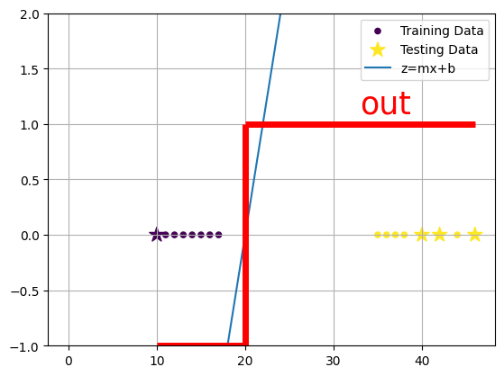

# Perceptron

[Wikipedia page on the Perceptron](https://en.wikipedia.org/wiki/Perceptron)

The Perceptron is a binary classifier (it classifies only two classes). These classes are either 1 or -1.
The model tries to find a line that seperates the two classes (The Decision Line). 
It uses the x-intercept of this line and horizontal lines from -1 and 1 to check which class the points would go to.
This line is called the Classification Line. If the points are under the line, it will be classified as 1.
If the points are over a line, it will be classified as -1.

